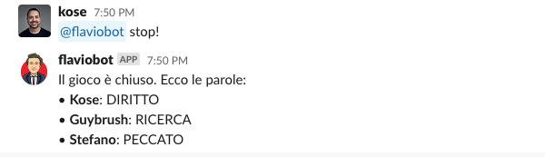

# Flaviobot

 

**Flaviobot** is a bot that allows you to play the popular Italian TV game ["La Ghigliottina"](<https://en.wikipedia.org/wiki/L%27eredit%C3%A0#%22La_Ghigliottina%22_(The_Guillotine,_round_7)>) with friends on Slack.

The goal is to be able to secretly store all the participants' words while the game is on and then reveal them all together when everybody has submitted a word. The bot is also able to store and update the players' scoreboard.


The name Flaviobot is inspired by **Flavio Insinna**, the former host of the TV show (I should probably call it Liornibot now, but it doesn't sound that cool).

## How does it work?

> ℹ️ &nbsp; since the gameshow is in Italian, the bot "speaks" only Italian.

### Bot invitation

The bot needs to be invited to your channel. It can also be a private channel. Just invite it as you would do with a real person. It will automatically accept and join.

### Start of the game

When the TV game is starting you need to tell the bot to be ready to accept the words.
The command is:

```
@flaviobot vai!
```


### Sending a word to the bot

You can now direct message the bot and provide your word. It will be memorized, to be shared later. The bot will also inform (in the channel where he was activated) that a certain user has provided a word (without revealing the word, of course)

_The word is sent in a direct message:_


_The bot updates everybody in the channel:_


In case you change your mind you can still submit a new word, while the game is still open. The bot will remember only the last word provided.

### Closing the game / revealing the words

Once everybody has submitted a word the game can be closed.
The command is:

```
@flaviobot stop!
```



The bot closes the game and reveals all the words that were submitted.

### Announcing the correct word / updating the chart

Once the correct word is revealed in the TV show, it can be communicated to the bot. In this way, the bot will update the chart in case there were winners.

```
@flaviobot era {WORD}
```


In case there are winners, the updated chart will be revealed. Otherwise, the bot will just communicate that nobody guessed the right word.


The scoreboard can be revealed at any time, by using this command:

```
@flaviobot classifica!
```


#### How points are calculated

The amount of points each player receives is based on the number of participants in that specific game session:

`n. of points = n. of players / n. of winners`

For example, if there are two players and both guess the word correctly, each receives one point.
If there are three players and only one guesses the word, that player receives three points, while the others receive none.

If a player is playing alone, with no other challengers, they will still receive the point if the word is guessed correctly. If not, they receive 0.25 points for participation. This participation bonus is awarded only when a player is playing alone. If there is more than one participant and nobody guesses the word, no points are awarded.

#### Extra points

In some cases, there may be an extra point to award. For example, if there are three players but only two correctly guess the word, each would normally receive one point, leaving one additional point unassigned. In this situation, instead of splitting the points evenly among the winners, the extra point is awarded to the player who answered correctly first.

#### How can I use it?

The bot right now is not distributed via the Slack App Directory. This means that, if you want to use it, you have to host it yourself somewhere and then install it in your workspace. In case you are interested in using the bot feel free to [contact me](https://github.com/antoniocosentino/flaviobot/issues/new/choose). I might consider distributing it in the future if I see enough interest.
