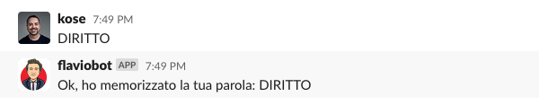

# Flaviobot

**Flaviobot** is a bot that allows you to play the popular Italian TV game ["La Ghigliottina"](https://en.wikipedia.org/wiki/L%27eredit%C3%A0#%22La_Ghigliottina%22_(The_Guillotine,_round_7)) with friends on Slack.

The goal is to be able to secretly store all the participants' words while the game is on and then reveal them all together when everybody has submitted a word.


## How does it work?
> ℹ️  &nbsp; since the gameshow is in Italian, the bot as well "speaks" only Italian.

### Bot invitation
The bot needs to be invited in your channel. It can also be a private channel. Just invite it as you would do with a real person. It will automatically accept and join.

### Start of the game
When the TV game is starting you need to tell the bot to be ready to accept the words.
The command is:
```
@flaviobot vai!
```


### Sending a word to the bot
You can now direct message the bot and provide your word. It will be memorized, to be shared later. The bot will also inform (in the channel where he was activated) that a certain user has provided a word (without revealing the word, of course)

*The word is sent in a direct message:*




*The bot updates everybody in the channel:*


In case you change your mind you can still submit a new word, while the game is still open. The bot will remember only the last word provided.

### Closing the game / revealing the words
Once everybody has submitted a word the game can be closed.
The command is:
```
@flaviobot stop!
```


The bot closes the game and reveals all the words that were submitted.

#
## Setup
### Natively (Node.js)
Clone this repo, then run:

`npm install`

You also need to create two environmental variables:

`export BOTPORT=80` the port where you want to run the bot

`export TOKEN=xxx-xxx` this is the token you get from Slack

When this is done you can simply run it with:
`npm start`

#
### Docker
First create a file on root level called `variables.env`

Then put here the environmental variables, as explained previously.

Example:
```
TOKEN=xxx-xxx
BOTPORT=80
```

When this is done you can run it with Docker:

`docker-compose up --build`

#

That's it. Enjoy!
